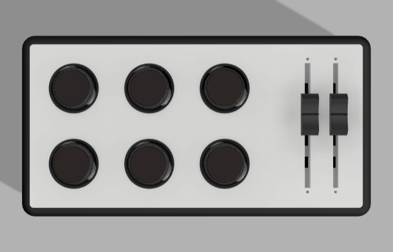

# MINI MIDI CONTROLLER CUSTOM

## Spesification
- 1 x Atmega32u4 Pro Micro
- 6 x Button Arcade with Transparant Frame + 2 RGB each Button
- 2 x Potentiometer slider
- 1 x USB Type B Female\

for Connection from Pro Micro to all Button and RGB you can use Connector and skun, 

## Preview Hardware

  
  
  
  

## Documentation
- [Dimension](https://github.com/juarendra/Mini_Midi_Controller/blob/main/HARDWARE/dimension%20custom.pdf)

## Pinout

  

## Wiring Connection
- [Wiring](https://github.com/juarendra/Mini_Midi_Controller/blob/main/HARDWARE/MiniMidiController_pinout.pdf)

## BOM
| Item  | QTY |
| ------------- | ------------- |
| Arduino Pro Micro  | 1  |
| Arcade Button with transparant Frame 30mm | 6  |
| Potentiometer slider  | 2  |
| RGB LED for Arcade Button | 12 + 1  |
| USB FEMALE type B | 1  |
| Wire and Skun | some  |

## FLASH FIRMWARE

